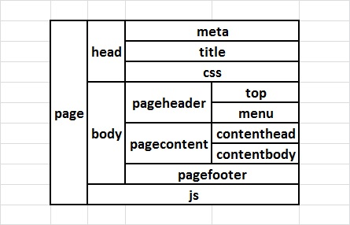

  Groundwork CSS 2 Web-Page Templates using Handlebars

```js
var gwcsshbs = require('gwcsshbs');
```

## Installation

```bash
$ npm install gwcsshbs
```

### Installation Dependencies

  * Node JS (v0.10.29+) - http://www.nodejs.org

## Features

  * Templating using [handlebars.js](https://github.com/wycats/handlebars.js)
  * Jade-like layout-blocks using [handlebars-layouts](https://github.com/shannonmoeller/handlebars-layouts)
  * Handlebars templates for [GroundworkCSS 2.5.0](https://github.com/groundworkcss/groundwork)
  * Live UI Design/Prototyping Preview

## Philosophy

  Reuable handlebars templates for UI design/prototyping with live preview based on
  GroundworkCSS responsive web-design. The idea is to use the existing templates as
  the starting point, and then refine them to suit individual UX needs.

## APIs

### Overview

  This module provides handlebars-based basic building blocks for creating web-pages using
  GroundworkCSS responsive web-design. It also provides a UI Live Preview design/prototyping
  environment. Reuse the layouts via block-helpers:
  * \#extend - extend a defined partial
  * \#block - define a block within a partial
  * \#append - append to a defined block
  * \#prepend - prepend to a defined block
  * \#replace - replace a defined block

  See templates-folder & preview.js for usage details.

### Live Preview

  Run preview.js using Node JS ("node preview.js"), and view the sample web-pages in the browser.
  Each of the view is available as as web-page at /[view] in the browser on port 8080 (for e.g.,
  http://localhost:8080/home). All changes made to the templates are available as "live" preview
  in the browser. The changes are monitored and the re-compiled automatically; also, the view in
  the browser(s) is refreshed. The live preview is very useful when designing UX for multiple browsers
  (e.g., browser compatibility) and/or multiple form-factors (e.g. mobiles, tablets, and desktops).
  As you build the UX, you can open the web-page in multiple browsers/devices, and monitor & debug
  the changes without the need to refresh the web-pages in the browsers.

  Any new views added to the system will need a restart of the node preview.js server. You may
  consider using other solutions like [nodemon](https://github.com/remy/nodemon) in case you want
  to restart the node server automatically.

  View (static) data is available in viewList[] of preview.js file. Some additional settings are
  available to control some features provided by this module:

```js
var viewList = {
    'home': {
        gwcsshbs: { // settings
            autoPageRefresh: true // web-page auto refresh
        }
    }
};
```

### Templates structure

  The current template structure is aligned to the sample web-pages provided by GroudworkCSS.
  However, most of it can be re-used with minor modifications to suit inidividual UX needs.
  Also, you can change the complete structure with a little effort. Below picture provides
  an overview of the templates structure.

  

  There are other useful templates which are used as building blocks for the pages. Please
  view the partials & helpers folder in templates. 

### GroundworkCSS & Documentation

  The setup tries to replicate the web-page samples provided by GroundworkCSS. For easy reference,
  the documentation is linked to locally hosted GroundworkCSS pages. If you are lost in the
  documentation, and want to come back to prototyping, just click on the top-logo of any page.

### gwcsshbs.init(callback)

  This API initializes the module and sets-up the handlebars templating system. On successful
  initialization, the callback provides an event-emitter useful for handling events from within
  the module (e.g., refresh).

```js
var webexhbs = require('webexhbs'),
    expresss = require('express'),
    gwcssResources = gwcsshbs.resources(express);

gwcsshbs.init(function (err, emitter) {...});
```

### gwcsshbs.resources(express)

  All the GroundworkCSS static resources (CSS, JS, Fonts, etc.) are available via this API.

```js
var webexhbs = require('webexhbs'),
    expresss = require('express'),
    gwcssResources = gwcsshbs.resources(express);

var app = express();
    app.use('/', gwcssResources);
```

### gwcsshbs.renderFile()

  Use engine.renderFile as the view-engine for Express JS  environment.

```js
var express = require('express'),
    gwcsshbs = require('gwcsshbs'),
    engine = webexhbs.engine;

app = express();
app.engine('hbs', gwcsshbs.renderFile);
```

### gwcsshbs.enableLogging()

  The handlebars engine logs messages using handlebars-logger. These messages may be useful
  for debugging purposes.

### Handlebars templates

  The handlebars template assets are available within the "templates" directory. They are divided as:
  * helpers - Handlebars helpers used within partials
  * partials - Handlebars re-usable partials based on GroundworksCSS
  * views - Sample web-pages using templates

### Handlebars module

  The handlebars module is export'ed from the main-module. This module instance has all the templates
  compiled and loaded for use.

```js
var webexhbs = require('webexhbs'),
    handlebars = webexhbs.handlebars;
```

## License

  [MIT](LICENSE)
